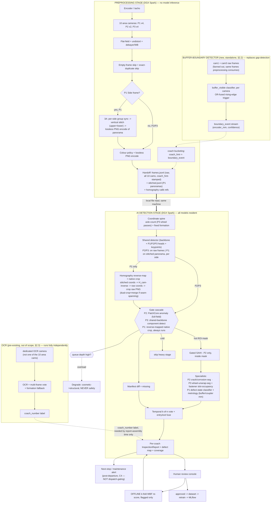

# VANDE BHARAT — FINAL AI/ML PIPELINE ARCHITECTURE (developer spec)

**Status:** revised — on-site architecture · **Date:** 2026-08-04
**Scope:** the full data flow from the preprocessing unit's input (raw camera
frames) to the AI detection pipeline's output (`InspectionReport`), **before**
report generation (PDF/console rendering is a downstream consumer, out of
scope here). This includes all **three parallel real-time tracks** that
consume camera frames simultaneously — the preprocessing unit, the new
buffer-boundary detector, and (for integration purposes only, not rebuilt
here) OCR — see §2.0 for why three, and §2.3 for the authority rules that
keep their outputs from being confused with each other.
**Supersedes:** the prior version of this document (RunPod cloud L4 + edge
node + upload architecture) is **stale and replaced**. That topology assumed
cloud-hosted inference behind a thin depot uplink; the actual target hardware
is an **on-site DGX Spark** with no upload step at all — a structurally
different system, not an incremental change. This document now consolidates
with, rather than contradicts, `pipeline.md` (AI pipeline developer spec) and
`README.md` (preprocessing unit developer spec), which are the section-level
sources of truth this document ties together end to end.
**Audience:** the developers building the unit. Every section is meant to be
actionable.

---

## 0. Locked constraints

| # | Constraint | Value | Consequence |
|---|---|---|---|
| C1 | Inference hardware | **NVIDIA DGX Spark (GB10), 128 GB unified memory, on-site** | Single device, no cloud, no upload step. Preprocessing and AI inference both run on this box. |
| C2 | Model residency | **All models resident in memory simultaneously — no load/unload during a run** | 128 GB unified memory is large enough to hold every model family at once; unlike a VRAM-constrained cloud GPU, there is no LRU/dynamic-load complexity to build. |
| C3 | Input format | **Lossless PNG, native resolution** (P1 also: lossless stitched panoramas) from the preprocessing unit | No lossy compression anywhere in the pipeline; no resize. |
| C4 | Overall SLA | **Input → detection conclusions ≤ 5 min** (preprocessing ≤ 3 min; detection ≤ ~2 min; measured detection ~30–70 s) | **Post-departure, alert-only** — confirmed: the verdict does **not** gate train dispatch. It feeds a next-stop/maintenance alert after the train has already left the depot. (Same operational shape as risk R1 below — being on-site removes the upload bottleneck but does not, by itself, change this operational decision.) |
| C5 | Scale | Up to 24 coaches per train | |
| C6 | Safety rule | Safety-critical checks are never skipped; un-inspected regions are reported `data_unavailable`, never "clean" | |
| C7 | Precision | Detectors/classifiers FP8 (INT8 fallback); segmentation FP16; anomaly FP16 | GB10 (Blackwell) supports FP8 natively — this differs from the old L4 (Ada Lovelace) plan, which could not. |
| C8 | Robustness | Single best TensorRT engine at serve; k-fold WBF ensemble **OFFLINE** on review-flagged cases only | Cheap serve; ensemble never runs on the live path. |
| C9 | Model layout | One shared detection backbone + zone-conditional heads (P1/P2/P3); wheel specialist standalone | One retrain loop for detection, one engine. |
| C10 | P1 side coverage | **Stitched panorama for component localization, raw frame for defect/metrology pixels** (the hybrid plan — see §2.1a) | Fixes components being cut at a camera edge without sacrificing pixel-precision for fine defects. |

### 0.1 Binding constraints (design is shaped by these, in order)

1. **No upload bottleneck.** Unlike the superseded cloud plan, preprocessing
   and inference share one on-site machine — the ≤5 min SLA (C4) is spent
   on **compute**, not network transfer. This is the single biggest structural
   difference from the old architecture.
2. **128 GB unified memory removes the VRAM-scarcity problem** the old L4 plan
   (24 GB) had to solve with Triton dynamic load/unload. Every model family
   stays resident (C2) — simpler serving, but still worth confirming the
   actual summed model footprint fits comfortably; see risk R-VRAM (§14).
3. **Single DGX Spark = SPOF + serial.** One train at a time; bursty arrivals
   still queue (§9 degrade policy) even without a network hop.
4. **Gate before you tile** (unchanged principle) — a cheap full-field pass
   still bounds the expensive segmentation/tiling stage to the ROI, because
   full-frame SAHI over P2/P3 is infeasible regardless of hardware location.
5. **P1's stitch/reverse-map/crop cycle is new compute** on top of the old
   plan's "detect direct" P1 path — its cost is not yet benchmarked on this
   hardware (§2.1a, §7).

---

## 1. Design principles

1. **One box, two stages, still logically decoupled.** Preprocessing (hard
   real-time, encoder-locked capture + assembly) and AI inference (soft
   real-time, ≤5 min total) run on the same DGX Spark but remain separate
   processes/stages with a **file-based handoff contract** (§3, §8) — not a
   network call, but still a clean boundary so each side can be developed,
   tested, and reasoned about independently.
2. **Gate before you tile.** No SAHI on blank surface. A cheap full-field pass
   (anomaly for P2, component-detect for P3) yields an ROI mask; expensive
   seg/tiling runs only inside it.
3. **Stitch for location, raw for pixels (P1 only).** The stitched panorama
   exists solely so a component isn't cut off at a camera's frame edge when
   localizing it. It is **never** the source of pixels for defect/metrology
   inference — that always comes from the untouched raw frame, found via a
   coordinate transform (homography), not a pixel transform. Full rationale:
   `SIDE_VIEW_HYBRID_PIPELINE_PLAN.md`.
4. **Axle-count = coordinate spine, and only axle-count.** Deterministic on
   the fixed VB formation — this is the sole authority for `coach_index`.
   Two other coach-identity signals exist in the system and must never be
   confused with it: **OCR** (`coach_number`, a label, already deployed —
   §2.3) and the **buffer-boundary detector** (`coach_hint`, a
   preprocessing-time storage convenience, new — §2.2, which also **retires
   gap-detection** for coach-boundary purposes). Full authority breakdown:
   §2.3's three-signal table.
5. **Shared detection backbone + zone heads** (C9). Wheel specialist
   standalone.
6. **Single engine at serve; WBF offline** (C8).
7. **Manifest-diff for "missing," temporal k-of-n voting for "present/defect."**
8. **Degrade tiers, never drop capture.** Under pressure: cosmetic →
   structural → never safety.
9. **Honest coverage, always.** A region that wasn't inspected is reported
   `data_unavailable`/`degraded` — never silently reported as passed.

---

## 2. System topology & data path

### 2.0 Three parallel real-time tracks — read this first

Three independent processes consume camera frames **at the same time**, on
the same on-site DGX Spark, off the same camera fleet. None of them blocks
on, or waits for, either of the others. This is the top-level shape of the
whole system and the single most important thing to understand before
reading any further section:

| Track | Cameras | Purpose | Model? | Status | Authority |
|---|---|---|---|---|---|
| **Preprocessing unit** | all 10 area cams (P1×4, P2×2, P3×4) | Flat-field/undistort/debayer, empty/dup skip, P1 stitching, lossless encode, handoff to AI pipeline | **No** (explicit invariant, `README.md` §1) | Build (this repo) | Produces the frames the AI pipeline detects on |
| **Buffer-boundary detector** | cam1 + cam3 (fanned out — same raw frames preprocessing also consumes) | Real-time coach-transition signal so preprocessing can bucket frames by coach as they arrive | **Yes** — new, this document (§2.2) | Build (new) | `coach_hint` — **storage convenience only, never report-authoritative** |
| **OCR (coach-number)** | dedicated OCR camera (existing system's own camera; not one of the 10 area cams — see §2.3) | Reads the human-readable coach number off the coach body | Yes — pre-existing | **Already deployed and working** — not rebuilt here (`pipeline.md` §0) | `coach_number` — **label only, never identity ground truth** |

**Why three, and why none of them defer to the others:** each answers a
different question, on a different clock, with different consequences if it
lags or fails —
- Preprocessing must never stall waiting on the other two (it owns the hard
  real-time capture path).
- The buffer-boundary detector's only consumer is preprocessing's own
  frame-storage bucketing — if it's late, at worst a few frames land in the
  wrong storage bucket, self-correcting at the next boundary event.
- OCR's only consumer is the final report's human-readable label — if it's
  low-confidence, the system already has a fallback (formation-based coach
  number inference, `pipeline.md` §5.7 coach-type classifier assists this).
- **None of the three is the AI pipeline's coordinate-spine ground truth.**
  That remains axle-count alone (§4). This separation is deliberate and is
  the answer to "which signal do I trust" whenever two of these three seem
  to disagree — see the authority table in §2.3.

### 2.1 Data path

```
                     ┌──► cam1 + cam3 (fan-out, same frames) ──► BUFFER-BOUNDARY DETECTOR (§2.2)
                     │                                            (new, standalone process, this doc)
                     │                                            replaces gap-detection for this use
                     │                                            │
                     │                                            └─ boundary_event stream
                     │                                               (encoder_mm-keyed)
                     │                                               │
[Cameras + encoder] ─┼─►  PREPROCESSING STAGE  ◄───────────────────┘   --local handoff-->  AI DETECTION STAGE
                     │    (DGX Spark, no model inference)                                  (DGX Spark, all models resident)
                     │    · capture, per-frame QA (empty/dup)                              · coordinate spine (axle-count)
                     │    · flat-field + undistort + debayer/WB                            · shared detector (backbone+heads)
                     │    · coach bucketing: coach_hint <- boundary_event stream            · P1 only: homography reverse-map
                     │    · P1 Side only: vertical stitch per                                  + native raw crop (§2.1a)
                     │      side (upper+lower) + homography                                · gate cascade -> gated specialists
                     │      calibration                                                    · temporal k-of-n vote + entry/exit fuse
                     │    · lossless PNG encode                                            · completeness (manifest diff)
                     │    · handoff: frames.jsonl + stitched.jsonl                          · InspectionReport assembly
                     │      + PNG files, on local/shared storage                             (coach_number attached here, from OCR)
                     │
                     └──► dedicated OCR camera (§2.3, existing system, separate
                          from the 10 area cams) ──► coach_number label ─────────────────► InspectionReport
                          (already deployed — not rebuilt here; runs fully independently,
                           its output only needs to arrive by report-assembly time, not in
                           real time during capture)
```

- **No edge/cloud split, no upload.** All tracks run on the same on-site
  DGX Spark. The preprocessing→AI-pipeline "handoff" is a local file write
  (PNG + JSONL) followed by a local read — no network transfer, no
  compression-for-bandwidth step. This single fact eliminates the entire
  superseded architecture's #1 constraint (uplink bandwidth) and its
  associated risk (old R2).
- **Preprocessing unit is standalone** — it never imports the detection
  pipeline; the only link is the handoff contract (`README.md` §1). This
  boundary is preserved from the original preprocessing design and is
  unaffected by co-locating all tracks on one machine, and is unaffected by
  the new buffer-boundary detector (§2.2 is architecturally separate from
  preprocessing, even though preprocessing consumes its output).
- **What crosses the handoff is a contract** (§9). Preprocessing and
  detection-pipeline developers build against it independently, exactly as
  before — the contract just no longer needs a compression/bandwidth budget.

### 2.1a The P1 hybrid stitch → reverse-map → crop cycle

This is the one part of the pipeline meaningfully redesigned since the prior
architecture. Full detail: `SIDE_VIEW_HYBRID_PIPELINE_PLAN.md`; preprocessing
side: `README.md` §3A; AI-pipeline side: `pipeline.md` §5.1/§5.1a/§6.

**Problem it solves:** P1 Side has 4 cameras arranged as two vertical 2×1
grids (right = cams 1 upper/2 lower; left = cams 3 upper/4 lower — see
`README.md` §2.2). A single camera's frame can cut a tall component (door,
window pillar, tall bracket) at its top/bottom edge.

**Solution, in one line:** stitch for *where*, crop raw for *what*.

1. Preprocessing stitches each side's upper+lower pair **vertically** →
   two full-height panoramas per instant (`p1_side_left`, `p1_side_right`),
   and computes/stores a homography (`H_cam`/`H_cam⁻¹`) per P1 camera relating
   its raw pixel space to its side's panorama pixel space.
2. The AI pipeline's shared detector runs **on the panorama** (per side) for
   component localization — this is where the full-height context prevents
   the cut-component problem.
3. Detected bbox/keypoint coordinates are reverse-mapped (`H_cam⁻¹`) back into
   the originating raw camera's coordinate space — a coordinate transform,
   not a pixel operation.
4. The actual crop used for the defect-state classifier and metrology
   arithmetic is sliced from the **original, untouched raw PNG** — never from
   panorama pixels, which carry stitch warp/blend unsuitable for pixel-precision
   inference.
5. If a component's reverse-mapped bbox spans the seam between the two
   raw cameras of a side, both raw frames are cropped and the result merged —
   this is the exact case stitching exists to fix, so it must be handled
   explicitly (`pipeline.md` §5.1a), not silently dropped.

**Nothing is ever reconstructed or un-stitched.** The raw per-camera frame and
the stitched panorama are two independent artifacts produced from the same
capture instant; the panorama's only job is telling the pipeline *where to
look* in the raw buffer.

### 2.2 Buffer-boundary detector — full spec (inlined from `COACH_BOUNDARY_BUFFER_DETECTOR.md`)

**Why this exists, and why it's a separate process:** the preprocessing unit
has a deliberate invariant — **it runs no models** (`README.md` §1) — so it
stays standalone and testable in isolation. Real-time coach-boundary
detection needs a model, so it cannot live inside preprocessing without
breaking that invariant. It also can't live inside the AI detection pipeline,
because its output is needed **during** preprocessing (to bucket frames by
coach as they're written), not after detection has already run. **Confirmed
with the system owner:** this is a third real-time process, alongside both,
running on the same DGX Spark hardware but as an independent process.

**It replaces the existing gap-detection model** for coach-boundary
detection specifically (confirmed, not assumed). It does **not** replace OCR
or the AI pipeline's axle-count spine — see the authority table in §2.3.

**Cameras:** cam1 (P1 Side, right, upper) and cam3 (P1 Side, left, upper) —
per the camera grid (`README.md` §2.2), these are the two P1 cameras most
likely to have a clean view of the buffer/coupling zone at the coach's
leading/trailing edge, one per side, at the same longitudinal position. Their
raw frames are **fanned out**: the same frames go to the normal 10-camera
preprocessing path (unchanged) **and** to this detector — neither consumer
blocks or depends on the other's completion. This does **not** use the
stitched P1 panorama (§2.1a) — that's a separate concern for a separate
purpose; this detector runs on the raw feed only.

**Model:**
- **Input:** raw cam1 frame and raw cam3 frame, independently.
- **Architecture:** lightweight single-class classifier — `buffer_visible`
  (yes/no) + confidence. **Open choice:** a classifier is proposed over a
  full detector (bounding box) because the triggering use case only needs
  presence, not localization — cheaper/faster for a real-time per-frame
  signal. Swap to a lightweight detector later only if a bounding box proves
  useful for QA visualization. Confirm before building.
- **Output per frame:** `{camera, seq, encoder_mm, buffer_visible, confidence}`.
- **Fusion across cam1/cam3 (proposed, not yet confirmed):** each camera's
  detector runs independently; a boundary event fires when **either** camera
  reports `buffer_visible` above threshold — OR fusion, recall-biased,
  matching the same "either view flags → recall" pattern already used for
  entry/exit wheel fusion (§7). Missing a coach boundary corrupts frame
  grouping for that whole coach; a slightly early/late trigger from one
  camera seeing the buffer sooner is a much smaller error. **Flag before
  building if AND-fusion is actually wanted instead** (trades recall for
  precision on the trigger).
- **Precision:** FP8, consistent with this system's detector/classifier
  precision policy (C7).

**Triggering logic — what "the coach is changing" means (stated assumption,
confirm before building):** the buffer is physically the coupling component
between two coaches, so a frame in which the buffer is visible is, by
definition, looking at the inter-coach gap. The **rising edge** of
`buffer_visible` (not-visible → visible) is the coach-boundary event:

```
on frame(camera in {1, 3}, buffer_visible, confidence, encoder_mm):
    if buffer_visible and confidence >= TAU_BUFFER and not previously_visible[camera]:
        emit boundary_event(encoder_mm, camera, confidence)
    previously_visible[camera] = buffer_visible
# fuse cam1 + cam3 events (OR): a boundary_event from either camera,
# deduplicated within a small encoder_mm window (both cameras see the same
# physical buffer at ~the same longitudinal position), becomes ONE signal.
```

- Keyed on `encoder_mm`, **never wall-clock** — same convention as every
  other position reference in this system.
- **Debounce (open, not yet sized):** a buffer stays visible across several
  consecutive frames as the train passes it — only the rising edge should
  fire, not every frame while visible, to avoid duplicate events per
  physical coupling. Window size not yet chosen; needs a value derived from
  typical buffer dwell-time in frame at line speed before building.

**Output contract → preprocessing's coach bucketing:**
- Preprocessing subscribes to this component's `boundary_event` stream.
- It maintains a running `coach_bucket_counter`, incremented on each event.
- Every kept `PreprocessedFrame` (all 10 cameras, not just cam1/cam3) is
  stamped with `coach_hint = coach_bucket_counter` at that frame's
  `encoder_mm` — this is the **existing but previously-unpopulated**
  `coach_hint` field in `preprocessed_frame.schema.json` (`README.md` §5);
  this component becomes its source.
- **`coach_hint` is a storage-organization convenience only** — it is never
  the authoritative `coach_index` used in the final `InspectionReport`
  (that's axle-count, §4). A bucketing error here does not corrupt the
  report; it only means some frames need re-sorting.
- **Late/out-of-order events at bucket edges (open, not yet decided):** if
  the event for a new coach arrives after some of that coach's frames were
  already written with the old `coach_hint`, those frames need re-stamping
  or an accepted short mislabeled window. Exact handling and tolerance not
  yet chosen — flag before building.

**Open items before building (none of these are guessed defaults — confirm
each):** classifier-vs-detector architecture; OR-vs-AND fusion; debounce
window size; late/out-of-order event handling; `TAU_BUFFER` confidence
threshold (needs labeled data to tune); training-data availability for the
new `buffer_visible` class (not covered by any existing dataset referenced
elsewhere in this repo's docs).

### 2.3 OCR (coach-number) — parallel track, out of scope but integrated

OCR is **already deployed and working** elsewhere in the final system
(`pipeline.md` §0) — it is **not rebuilt or redesigned in this document**.
It is included here only so its place in the overall data flow, and its
relationship to the other two coach-identity signals, is unambiguous.

- **What's known:** OCR reads the human-readable coach number off the coach
  body and supplies it as a label, with voting across multiple frames and a
  formation-based fallback when confidence is low (`pipeline.md` §5.7
  context — the coach-type classifier assists this fallback path).
- **What's not established in this architecture and should not be assumed:**
  which physical camera OCR reads from. A prior, now-superseded version of
  this document referenced a dedicated "cam12" for this — that reference is
  **not carried forward as confirmed**, since it belonged to the old
  cloud/edge topology. If OCR uses a specific camera outside the 10 area
  cameras this document governs, treat that as an existing fact of the
  already-deployed OCR system, not a decision made here.
- **Timing:** OCR does not need to run in real time during capture — unlike
  the buffer-boundary detector (§2.2), whose output is needed *during*
  preprocessing, OCR's `coach_number` only needs to be available by the time
  the `InspectionReport` is assembled (§9), since it's attached as a label,
  not used to bucket or gate anything upstream.

**The three-signal authority table (the single most important table in this
document for avoiding confusion):**

| Signal | Source | Populates | Authority | If wrong/late |
|---|---|---|---|---|
| **Axle-count** | P3 wheel-pass detection (§4) | `coach_index` on every detection, in the final `InspectionReport` | **Ground truth — hard fail on mismatch, never silently renumbered** | Pipeline halts/flags rather than silently mis-attributing a defect to the wrong coach |
| **Buffer-boundary detector** | cam1+cam3, new (§2.2) | `coach_hint` on preprocessed frames, storage-only | **Convenience only** — never read by the AI pipeline's coordinate spine | A mis-bucket means some frames are stored out of order; re-sortable, does not corrupt the report |
| **OCR** | dedicated OCR camera, pre-existing | `coach_number` (human-readable label) on the final `InspectionReport` | **Label only** — never used for identity/indexing | Low-confidence OCR triggers formation-based fallback (`pipeline.md` §4/§5.7); report still correctly indexed by axle-count regardless |

**Rule of thumb for developers:** if you ever find yourself needing "the
coach" for anything that affects correctness of a defect's location in the
report, use axle-count. If you need it for storage/file-organization
convenience during preprocessing, use `coach_hint`. If you need it for what
a human reads on the report, use `coach_number`. Never substitute one for
another.

---

## 3. Unified pipeline



**Execution order:** capture → per-frame QA/skip → (P1: stitch + calib
stamp) → colour policy → lossless PNG encode → local handoff → coordinate
spine → shared detector (zone-conditional input) → **P1: reverse-map + native
crop** → gate cascade → gated specialists → k-of-n vote (+ entry/exit fuse) →
completeness → report assembly → **[stop — before report generation]** →
alert → post-hoc review → offline WBF → retrain.

---

## 4. Coordinate spine (developer detail)

Unchanged from `pipeline.md` §4 — restated here because everything downstream
depends on it landing correctly.

Ground truth = **axle-pass count** from the P3 wheel cameras (cams 8–11). VB
rakes are fixed formation → axle sequence deterministic → `coach_index`.

```
on wheel_pass_event(camera, encoder_mm):
    axle_counter += 1
    coach_index = axle_counter_to_coach(axle_counter)      # fixed formation map
    stamp = { coach_index, axle_id, side, view(entry/exit), longitudinal_position_mm }
```

- Every detection inherits `(coach_index, coach_type, axle_id, side, view,
  longitudinal_position_mm)`.
- `longitudinal_position_mm` comes from `encoder_mm`, **never wall-clock**.
- **Coach-number label (OCR) is out of scope** — already deployed and
  working elsewhere; this pipeline's identity logic does not depend on it
  (`pipeline.md` §0, §4). Its output (`coach_number`) is attached to the
  final `InspectionReport` alongside `coach_index` for human readability
  only — see the authority table in §2.3.
- **Gap-detection is retired for coach-boundary purposes**, replaced by the
  new buffer-boundary detector (§2.1a below, `COACH_BOUNDARY_BUFFER_DETECTOR.md`).
  That said, its output (`coach_hint`) is a **preprocessing-time storage
  convenience only** — it never feeds this spine. `coach_index` here is
  axle-count-derived and axle-count-derived alone; the two signals are
  intentionally decoupled (see the companion doc §5 for why).
- **Invariants (hard):** axle count must equal the formation's expected count
  (mismatch = hard fail, never silently renumbered); encoder positions must
  be monotonic non-decreasing.
- P1's stitch-group sync (`README.md` §3A.2) uses this same `encoder_mm`
  matching mechanism to pair a side's upper+lower frames — one sync
  mechanism, reused, not reinvented for stitching.

---

## 5. Per-zone model stacks + I/O contracts (summary)

Full model-by-model spec (architecture, precision, metric, threshold config
key) lives in `pipeline.md` §5 — this table is the cross-reference, not a
duplicate source of truth.

### P1 — SIDE (cams 1–4 raw + 2 stitched panoramas) · completeness-first
| Stage | In | Out | Ref |
|---|---|---|---|
| Shared backbone + P1 head (detect + keypoints) | **stitched panorama**, per side, tiled 1280px | boxes+class+conf, keypoints — **panorama coords** | `pipeline.md` §5.1 |
| Homography reverse-map + native crop | panorama-coord bbox/keypoints + `calib_version` | **raw-coord** bbox/keypoints + native raw crop(s) | `pipeline.md` §5.1a |
| Defect-state classifier | native raw crop + margin | condition class | `pipeline.md` §5.2 |
| Metrology | native raw keypoints + px-to-mm calib | buffer height, coupler sag | `pipeline.md` §5.1 |
| Completeness engine | detections vs manifest | present/missing/displaced | `pipeline.md` §8 |

No SAHI on P1 (parts ≥15mm). Lowest degrade priority.

### P2 — UNDERCARRIAGE (cams 5, 6 — line-scan cam 7 out of scope, `pipeline.md` §0) · crack + anomaly
| Stage | In | Out | Ref |
|---|---|---|---|
| P2 anomaly (PatchCore) — **GATE** | raw strip, downsampled | per-region anomaly score → ROI mask | `pipeline.md` §5.3 |
| Shared backbone + P2 head (detect) | raw strip (coarse) | under-slung component boxes | `pipeline.md` §5.1 |
| P2 crack-seg | gated SAHI (320px, 0.20 overlap) inside ROI mask | crack/corrosion masks + length | `pipeline.md` §5.4 |

### P3 — UNDER-BOGIE / WHEEL (cams 8–11) · safety-critical
| Stage | In | Out | Ref |
|---|---|---|---|
| Shared backbone + P3 head (detect) — **GATE** | raw frame, downscaled | wheel + bogie-hardware boxes; feeds axle spine | `pipeline.md` §5.1, §4 |
| P3 wheel-seg | wheel crop → log-polar unwrap | shelling %/length, flat count, tread-crack mask | `pipeline.md` §5.5 |
| P3 fastener slot-occupancy | crop at known bracket-slot position | occupied? + verifier conf | `pipeline.md` §5.6 |

Entry+exit two-view fusion per physical wheel, keyed on axle sequence (never
appearance): either-view flag → recall; both agree → precision.

---

## 6. The gate cascade (condensed — full detail `pipeline.md` §6)

```
# P1 (side) — always runs (no anomaly-style gate; the reverse-map/crop IS the gate)
panorama_boxes = detect(stitched_panorama[side])           # per side, tiled 1280px
for box in panorama_boxes:
    raw_coords = H_cam_inverse(box, calib_version)         # coordinate transform only
    crop = crop_raw(raw_coords, margin=7.5%)                # dual-crop+merge if seam-spanning
    result = defect_state_classifier(crop); metrology(crop) # batched, not sequential

# P2 (belly) — anomaly-gated
mask = anomaly.score(strip_downsampled) > TAU_ANOMALY
tiles = sahi_tiles(strip_fullres, mask, tile=320, overlap=0.20)   # ONLY inside mask
crack_masks = crack_seg(tiles)

# P3 (bogie) — component-detect gated
comp = detect(frame_downscaled)
for wheel in comp.wheels:
    unwrap = log_polar(wheel, seed=geom_prior); wheel_seg(unwrap)
for slot in expected_slots(comp.brackets):
    occupied = slot_check(slot); if candidate: verifier(slot)
# NO full-frame SAHI anywhere in P2/P3 outside the gated mask; NONE in P1 ever.
```

**Tile/crop cost:** the previous version of this document had a measured
tile-throughput budget for the L4 (~300 tiles/s, ~30–40 s/train total). Those
numbers were specific to that GPU and are **not carried forward** — they do
not apply to the DGX Spark. `pipeline.md` C4 gives the only measured figure
we actually have for this hardware: **detection ~30–70 s/train** (measured,
whole-pipeline). **The added P1 stitch + reverse-map + crop cost is not yet
separately benchmarked** — `README.md` §7 flags the same gap on the
preprocessing side. Do not assume it fits without measuring.

**Gate-recall is still the safety knob for P2** (a low anomaly score → never
tiled → missed defect). Conservative threshold + periodic offline full-SAHI
audit to measure/re-tune gate recall — unchanged from the prior design.

---

## 7. Temporal voting & fusion (developer detail)

Unchanged from `pipeline.md` §7 — reproduced here for flow completeness.

```
for det in detections:
    cell = quantize(coach_index, longitudinal_position_mm, side)
    votes[cell][det.class].append(det.conf)

for cell, classes in votes.items():
    for cls, confs in classes.items():
        if len(confs) >= VOTE_K_OF_N and mean(confs) >= TAU[cls]:
            flag(cell, cls)

# P3 entry+exit fusion per physical wheel
wheel_health[coach,axle,side] = fuse(entry_flags, exit_flags)   # OR for recall, AND for precision
```

Manifest diff runs on the **voted present-set**, not raw detections → false-missing suppressed.

---

## 8. Serving on the DGX Spark (developer detail)

This section replaces the old Triton-on-L4-with-dynamic-load-unload plan.
128 GB unified memory (C1/C2) removes the reason for that complexity.

- **All model engines resident for the whole session** (C2) — no LRU
  load/unload, no per-model swap-in latency. Simpler serving story than the
  superseded plan.
- **Serving framework:** extend the existing `GPU/yolo/server.py` (repo
  asset — see §13). Whether that remains a Triton-based server or a simpler
  local multi-model server is an **open implementation choice**, not decided
  in this document — the old plan's Triton usage was driven by L4 VRAM
  scarcity, which no longer applies, so re-evaluate rather than carry it
  forward by default.
- **Precision:** FP8 for detectors/classifiers (INT8 fallback), FP16 for
  segmentation and anomaly (C7) — GB10/Blackwell native FP8 support, unlike
  the L4 plan this document previously specified.
- **New compute on this stage vs. the superseded plan:** the P1 homography
  reverse-map + native crop stage (§2.1a, §6) runs here, per-train, for every
  P1 component detected on a stitched panorama. It must batch all crops for
  a panorama into a single inference call — sequential per-crop calls would
  add kernel-launch overhead per component and risk the SLA (C4). See
  `SIDE_VIEW_HYBRID_PIPELINE_PLAN.md` §6 for the full latency analysis this
  requirement is based on.
- **Engine cache** on persistent local storage — engines are driver/arch
  locked; pin CUDA/driver version. Rebuild = minutes, never on the live path.

---

## 9. Data contracts (preprocessing ↔ AI pipeline ↔ report)

No "upload envelope" — this is a **local handoff**, read directly from disk.
Full schemas: `README.md` §5 (preprocessing side, authoritative) and
`pipeline.md` §2, §11 (AI-pipeline side, authoritative). Summarized here for
flow context only:

**Preprocessing → AI pipeline handoff (per kept frame/panorama):**
- `frames.jsonl` — one record per raw frame, all 10 cameras
  (`preprocessed_frame.schema.json`; P1 records additionally carry
  `homography_ref`).
- `stitched.jsonl` — one record per successfully-stitched P1 side per instant
  (`stitched_frame.schema.json`, up to 2/instant: `p1_side_left`,
  `p1_side_right`).
- PNG files referenced by both, on local/shared storage the AI pipeline reads
  directly — no compression-for-bandwidth, no retry/queue logic needed since
  there is no network hop.

**Detection record (internal, AI pipeline):**
```json
{"coach_index":13,"coach_type":"LHB","zone":"P3","axle_id":1,"side":"L","view":"entry",
 "longitudinal_position_mm":8214,"class":"wheel_shelling","conf":0.71,
 "mask_ref":"...","votes":4,"tier":"safety"}
```

**InspectionReport (per coach) — the endpoint of this document's scope:**
manifest status table + defect list (voted) + defect-map overlay + crop
thumbnails + per-flag confidence + tier + review-status + coverage
(`inspection_report.schema.json`, `pipeline.md` §10, §11), **plus**:
- `coach_index` — from axle-count (§4), **authoritative**.
- `coach_number` — from OCR (§2.3), attached as a label at report-assembly
  time; independent process, no upstream dependency on this pipeline.

`coach_hint` (from the buffer-boundary detector, §2.2) is **not** part of
the `InspectionReport` — it only ever exists inside the preprocessing
handoff (`frames.jsonl`), as a storage-bucketing aid consumed entirely
within preprocessing. It never crosses into the AI pipeline's output.

Report *generation* (rendering this into the operator-facing
document/console) is the next stage, out of scope here.

---

## 10. Unified config (`orchestrator/config/pipeline_config.yaml` extension)

```yaml
runtime:
  inference_host: dgx_spark_onsite     # single device, no cloud, no upload
  model_residency: all_resident        # C2 — no dynamic load/unload
  sla_minutes: 5                       # C4; post-departure, NOT dispatch-gating
  handoff:
    mode: local_file                   # frames.jsonl + stitched.jsonl + PNG, same machine
    compression: none                  # lossless throughout (C3) — no bandwidth-driven compression

spine:
  ground_truth: axle_count             # OCR/gap-detection out of scope (deployed elsewhere)

gate:
  p2_anomaly_percentile: 99.0
  p3_gate: component_detect

tiling:
  p1: { sahi: false, tile: 1280, source: stitched_panorama }
  p2: { sahi: true,  tile: 320, overlap: 0.20, gated: true }
  p3: { sahi: false, fastener: slot_occupancy, wheel: log_polar_unwrap }

homography:                            # P1 reverse-map + native crop — NEW
  crop_margin_pct: 7.5
  batch_crops: true                    # non-negotiable, see §8
  seam_merge_iou: 0.30
  calib_source: preprocessing_unit     # H_cam / H_cam_inverse versioned per README.md §3A.1

models:
  backbone: shared_backbone_v1
  heads: {p1: p1_side, p2: p2_under, p3: p3_bogie}
  p1_damage: p1_side_damage
  p2_anomaly: p2_under_anomaly
  p2_crackseg: p2_under_crackseg
  p3_wheel: p3_wheel_shelling
  p3_fastener: p3_fastener
  precision: {detectors: fp8, seg: fp16, anomaly: fp16}
  serve: single_engine                 # WBF is OFFLINE only

voting:
  k_of_n: 3
  cell_size_mm: 100.0
  fuse_entry_exit: true

completeness:
  missing_min_views: 2

confidence:
  component: 0.35
  p1_damage: 0.40
  crack_dice_min: 0.30
  shelling_dice_min: 0.30
  fastener_recall_conf: 0.20
  comp_defect: 0.40

exclude_classes: [leakage]

degrade:
  order: [cosmetic, structural]        # safety never degraded
  queue_high_watermark: 0.8
  fifo_capacity: 4
```

---

## 11. Failure & degrade policy

| Event | Behaviour |
|---|---|
| Inference lag | bounded per-train FIFO; degrade cosmetic→structural→**never safety** |
| P2 flag-rate spike | gate caps tiles; overflow ROIs → lazy structural queue (may exceed 5 min) |
| Dropped camera frame / line | QA marks region invalid; not silently distorted |
| **P1 side missing a stitch (one camera of a pair dropped)** | that side's stitched panorama is skipped for that instant (`README.md` §3A.2); the individual raw frame that does exist is still processed normally; the *other* side is unaffected |
| **Stale homography calibration (rig drift)** | crop misaligns silently — a false negative, not a crash. No automated detection built yet; flagged as open (§14 R-HOMOG). Calibration is versioned (`calib_version`) so a bad batch is at least traceable after the fact. |
| DGX Spark process crash | in-flight train's preprocessing output already sits on disk (durable) — AI pipeline stage can resume/replay from the handoff files on restart; verdict delayed, not lost |
| No dispatch gate (C4) | missed safety defect already departed → rely on next-stop alert + recall-biased safety thresholds (risk R1, below — unchanged operational shape from the prior architecture) |

---

## 12. Retrain loop

Review console → approved → dataset (**pseudo/synthetic → train split only,
never valid/test**) → retrain → MLflow → deploy to the DGX Spark with
**shadow-mode canary before promote** (no A/B-across-region complexity — one
device, sequential canary window instead). Anomaly models: automated
**confirmed-normal purity gate** before training (one defect poisons
PatchCore). This stage is orthogonal to the on-site-vs-cloud change and is
carried forward unmodified from the prior architecture.

---

## 13. Repo integration points

| Need | Existing asset | Action |
|---|---|---|
| Capture/ring/spill | orchestrator `FrameCaptureManager`, `RingBufferManager` | reuse |
| Coach identity (report) | axle-count spine (authoritative) + OCR label (`coach_number`) | reuse both; axle-count spine is primary, OCR unchanged/already deployed (§2.3, §4) |
| **Coach bucketing at capture time (new)** | `GapDetectionManager` — **being retired for this purpose** | replace with the new buffer-boundary detector (§2.2, `COACH_BOUNDARY_BUFFER_DETECTOR.md`); new standalone process, cam1/cam3 fan-out, `boundary_event` stream consumed by preprocessing's new bucketing logic |
| OCR system integration | existing OCR pipeline (camera + model + vote/fallback) | **no changes** — this document only documents where its output (`coach_number`) attaches to the `InspectionReport` (§9); do not modify the OCR system itself |
| **P1 stitching (new)** | `stitch.py` (existing) — needs the vertical per-side upper+lower logic + homography calibration described in `README.md` §3A | **fix stale comments (old resolution assumptions); implement per-side 2-camera vertical stitch; add `homography.py`** |
| Detection | `component_stage_a_v1`, `defect_stage_b_v1` | refactor into shared backbone + zone heads |
| **P1 reverse-map + crop (new)** | none yet | new module in the AI detection pipeline — `pipeline.md` §5.1a |
| Serving | `GPU/yolo/server.py` | extend for DGX Spark, all-resident load, batched crop inference (§8) — re-evaluate whether Triton is still the right fit now that VRAM scarcity no longer drives the design |
| Registry | `model_manager.py`, MLflow | add backbone + head + specialist families |
| Review/retrain | verification console, `DefectReviewLog`, `pseudo_label.py`, `rebuild_splits.py` | reuse; enforce train-split-only for pseudo |
| Export | `export.py --format engine --half` | + FP8 calibration for detectors (C7) |

---

## 14. RISK REGISTER (ordered by severity — do not ignore)

Risks specific to the superseded cloud/edge/upload architecture (old R2:
upload-link bandwidth; old R3: single-*L4* SPOF; old R5: PTP requirement for
cross-cluster fusion — not established as a requirement in `pipeline.md`) are
**removed**, not carried forward, since they don't apply to the on-site
single-device topology. New/changed risks below.

| ID | Risk | Mitigation | Status |
|---|---|---|---|
| **R1** | No dispatch gate (C4) → missed safety defect departs depot | reliable next-stop alert + recall-biased safety thresholds; **confirmed** post-departure/alert-only for now — revisit if operational policy changes | **OPEN — operator ratify** (unchanged from prior architecture) |
| **R-HOMOG** | Stale P1 homography calibration (rig vibration/thermal drift) → reverse-mapped crop misaligned → silent false negative | periodic recalibration + automated drift health-check (not yet built — `README.md` §10 flags the same gap); `calib_version` at least makes a bad batch traceable after the fact | **OPEN — no owner assigned yet, preprocessing unit or AI pipeline** |
| **R-SEAM** | P1 component bbox spans the upper/lower camera seam within a side panorama → dual-crop merge logic (§6, `pipeline.md` §5.1a) has a bug → double-count or dropped detection | IoU/position-based merge, exercised in tests before shipping | **OPEN — needs test coverage once built** |
| **R-STITCH-COST** | P1 stitch + reverse-map + crop cost is unbenchmarked on the DGX Spark → could push detection past the ~2 min budget slice of C4 | measure before sign-off; `README.md` §7 has the same open item on the preprocessing side | **OPEN — needs benchmarking** |
| **R-VRAM** | 128 GB unified memory is *assumed* sufficient for all resident model families (C2) but the summed footprint has not been measured | measure actual resident footprint across all model families before assuming headroom | **OPEN — needs measurement** |
| **R-BUFFER** | Buffer-boundary detector is new and untrained — architecture, fusion rule, debounce window, and confidence threshold are all still open (`COACH_BOUNDARY_BUFFER_DETECTOR.md` §7); a missed/late boundary event mis-buckets frames at a coach edge | since `coach_hint` is a storage convenience, not report-authoritative (§4), a mis-bucket does not corrupt the final report — but it does create operational noise (frames to re-sort) until tuned | **OPEN — new component, no training data yet** |
| **R3** | Single DGX Spark = SPOF + serial; bursty back-to-back trains can queue past the SLA | bounded queue + lazy degrade (§11); consider a second device only if profiling demands it | OPEN — needs profiling data |
| **R6** | Anomaly-gate (P2) blind spot → defect never tiled, never seen | conservative threshold + periodic offline full-SAHI audit (gate-recall metric) | DESIGNED-IN |
| **R7** | Lossy camera output kills sub-mm crack signal | mandate lossless P2/P3 (and P1 raw + stitched, C3) | OPEN — camera hardware confirmation |
| **R8** | Auto-exposure/focus drift poisons the anomaly gate | fixed exposure/gain/focus | OPEN — camera hardware confirmation |
| **R9** | Human-review desk = throughput ceiling | size reviewers to flag-rate; auto-clear only WBF-agreed low-risk | OPEN — needs review capacity data |
| **R10** | Label scarcity (crack/corrosion/fastener/spring) | anomaly-first ship; pseudo-label train-split; copy-paste aug | OPEN — needs label counts |
| **R11** | Mono sensor (P3) → weak corrosion recall if colour-cued signal is needed there | texture-only corrosion for greyscale zones; colour is P1/P2 only | OPEN — camera confirmation |
| **R13** | Wheel-unwrap mis-centering fakes defects | geometry-seeded circle fit; reject poor-residual frames | DESIGNED-IN |
| **R14** | Manifest/coach-type error → false-missing storm | version manifests per type; validate on known-good rakes | DESIGNED-IN |

---

## 15. Build order

1. **Coordinate spine** — axle-count indexing + fixed formation (unblocks everything).
1a. **Buffer-boundary detector** (`COACH_BOUNDARY_BUFFER_DETECTOR.md`) — new standalone component; needs its open items (§7 of that doc: architecture, fusion rule, debounce, threshold, training data) closed before it can reliably drive coach bucketing. Can be built in parallel with steps 1–2 since it's independent of both preprocessing internals and the AI pipeline.
2. **Preprocessing: raw handoff** — the 10-camera lossless PNG path (`README.md` §3), unchanged core logic, **plus** the new coach-bucketing consumer of the buffer-boundary detector's event stream (§2.1a-adjacent, `README.md` §1).
3. **Preprocessing: P1 stitch + homography calibration** — `README.md` §3A; this is new, needs the calibration method/stitcher-library decisions closed first (`README.md` §10).
4. **Shared backbone + P1/P2/P3 heads** — FP8 export, MLflow. P1 head trained/run against **stitched panoramas**, not raw frames.
5. **P1 reverse-map + native crop stage** (`pipeline.md` §5.1a) — new AI-pipeline module; needs batched-inference implementation from day one (§8), not retrofitted later.
6. **P2 anomaly baseline** (PatchCore, confirmed-normal) — the ROI gate that fits P2 in budget.
7. **P3 wheel specialist** — crop → log-polar → shelling/crack seg.
8. **P3 fastener slot-occupancy** + verifier.
9. **P2 gated crack/corrosion seg** inside anomaly mask.
10. **P1 defect-state classifier + metrology** — running on native raw crops from step 5.
11. **Temporal k-of-n voting + entry/exit fusion**.
12. **Completeness (manifest diff) + InspectionReport assembly** — the stated endpoint of this document.
13. **Degrade policy + monitoring** — p50/p95/p99 last-coach→verdict per tier; gate-recall audit; homography-drift audit (R-HOMOG).
14. Report generation, alerting, review console, offline WBF, retrain loop — downstream of this document's scope, proceed per §12.

---

## 16. Open GO/NO-GO gates before coding (hardware/operator)

- **Camera:** lossless P1/P2/P3 output confirmed (R7); fixed exposure/focus confirmed (R8); mono-sensor corrosion-recall implication accepted (R11).
- **R1 ratification** — confirmed post-departure/alert-only for now; re-ratify if that operational policy is ever revisited.
- **Homography calibration method** — checkerboard/marker vs. feature-matching (`README.md` §10) — must be decided before build-order step 3.
- **Stitcher library/algorithm** — must be decided before build-order step 3 (`README.md` §10).
- **R-VRAM measurement** — confirm the actual resident-model footprint before committing to "all models resident, always" as final (C2) rather than assumed.
- **Label counts** per zone (R10) · **review capacity** (R9).

All other decisions run on the defaults recorded above. Green-light the gates → start at build-order step 1.
